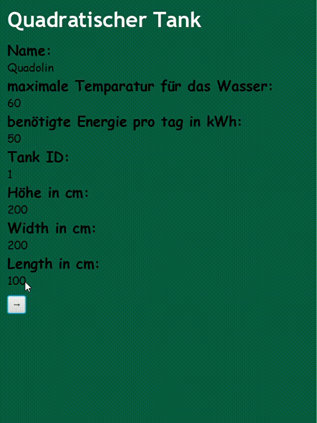
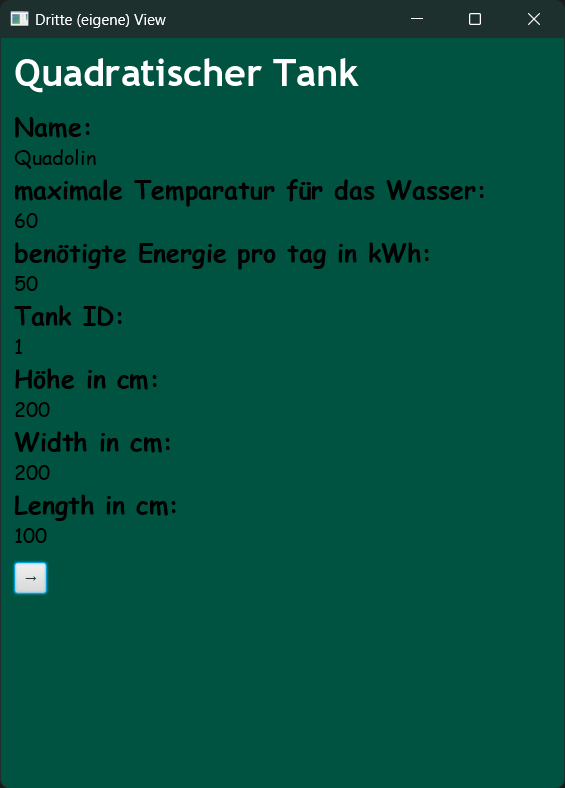
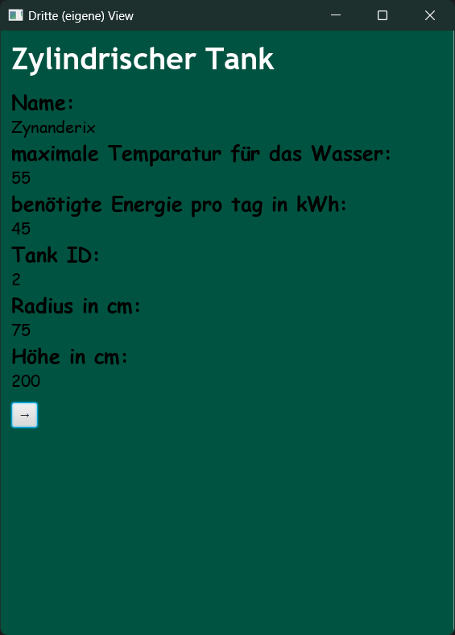

# 🔥 Heat Calculator  
*Calculate how long your solar-heated water tank can keep the heat running*


---

## 🎞 Demo

<div align="center">
  
</div>

---

## ⚙️ Key Features

### ✅ Navigate Through 3 Tank Types

Each tank is presented on its own page. You can cycle through them using the arrow at the bottom of the UI.

#### 🟥 Quadolin (Cubic Tank)


#### 🟦 Zynandrix (Cylindrical Tank)


#### 🟩 Liliane (Custom Volume Tank)


---

### 🧠 Object-Oriented Design

- Separate Java classes for each tank type
- Inheritance and polymorphism used to streamline code
- Modular and extendable design

---

### 🧩 Built with JavaFX & MVC

- Custom-designed UI with smooth navigation
- Model-View-Controller architecture for clean separation of concerns
- Modern JavaFX visuals

---

## 📚 Project Context

> This project was created at **gibb** during the *Modul 320* course.  
>  
> It was built to apply and deepen my understanding of **Object-Oriented Programming** using Java.  
>  
> I developed different tank types with shared and unique properties, then brought it all together with a JavaFX UI based on the **MVC pattern**.  
>  
> The focus was on clean structure, solid logic, and good separation of concerns.

---

## 🚀 How to Run the Project

```bash
# 1. Clone the repository
git clone https://github.com/lorisjon/HeatCalculator.git

# 2. Open in your Java IDE (e.g. IntelliJ IDEA or Eclipse)

# 3. Make sure JavaFX is installed and set up correctly

# 4. Run the application from the main class
```

---

## 👤 About the Developer

> I'm a software developer with a strong interest in elegant UIs, and practical programming principles, though this project was mainly in order to learn object-oriented programming.
>  
> This project helped me dive deep into **OOP** and **GUI development** in Java.  
>  
<!-- > 🔗 [View my Portfolio](https://your-portfolio-url.com) --> 
